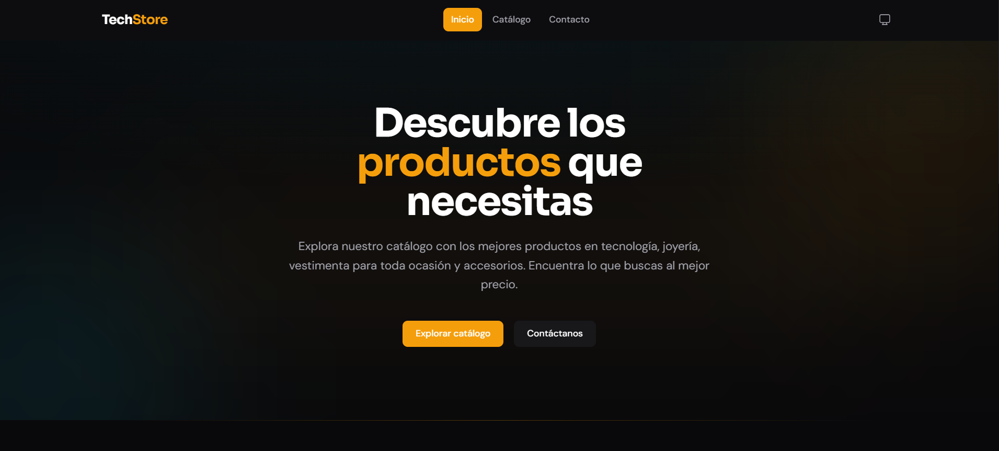

# TechStore — Catálogo Web de Tecnología

[](https://www.typescriptlang.org/)
[](https://react.dev/)
[](https://vite.dev/)
[](https://tailwindcss.com/)
[](#-testing)
[](https://vercel.com)

Aplicación web frontend de catálogo de tecnología con apariencia de ecommerce moderno. Diseñada como proyecto de portafolio y demo comercial, enfocada en alta calidad visual, experiencia de usuario fluida, y código limpio con arquitectura escalable.

> **Stack principal:** React 19 · TypeScript 6 · Vite 8 · TailwindCSS 4 · React Router DOM 7

---

## ✨ Características

- **Catálogo interactivo** — Navegación multipágina con productos categorizados
- **Búsqueda y filtros** — Búsqueda textual y filtrado por categoría en tiempo real
- **Vista detalle de producto** — Galería, especificaciones técnicas y botón de contacto
- **Integración con WhatsApp** — Enlaces dinámicos para consultas de productos
- **Dark Mode** — Alternancia entre tema claro y oscuro con persistencia en `localStorage`
- **Diseño responsivo** — Adaptado a móviles, tablets y desktop
- **Animaciones suaves** — Transiciones respetuosas con `prefers-reduced-motion`
- **Rendimiento** — Lazy loading con `React.lazy` y `Suspense`
- **Accesibilidad** — Atributos ARIA, skip-to-content, focus visible, roles semánticos
- **271 tests unitarios** — Cobertura completa de componentes, hooks y utilidades

---

## 🖼️ Vista Previa



---

## 🧱 Arquitectura

El proyecto sigue una **Feature-Based Architecture** combinada con **Component-Driven Development** y el patrón **Container/Presentational**.

```
src/
├── features/             # Dominios de funcionalidad
│   ├── home/             # Página principal (Hero, Categorías, Destacados)
│   ├── catalog/          # Catálogo (búsqueda, filtros, grid)
│   ├── product/          # Detalle de producto (galería, specs, WhatsApp)
│   └── contact/          # Página de contacto (formulario, info, mapa)
│
├── shared/               # Módulos reutilizables
│   ├── api/              # Clientes HTTP (productApi)
│   ├── components/       # UI atómicos (Button, Badge, ProductCard, Icons)
│   ├── context/          # Contextos globales (ThemeContext)
│   ├── hooks/            # Hooks reutilizables (useDarkMode, useInView)
│   ├── interfaces/       # Tipos compartidos (Product)
│   ├── layouts/          # Layouts (MainLayout, Navbar, Footer)
│   ├── mappers/          # Transformadores de datos (productMapper, categoryMapper)
│   ├── services/         # Servicios legacy (en migración a api/ + mappers/)
│   ├── styles/           # Estilos globales
│   └── utils/            # Utilidades (whatsapp)
│
├── routes/               # Configuración de React Router con lazy loading
├── integration/          # Tests de integración (flujos de usuario)
├── test/                 # Setup global de testing
├── App.tsx               # Shell de la aplicación
└── main.tsx              # Punto de entrada
```

### Patrones aplicados

| Patrón                   | Implementación                                  |
| ------------------------ | ----------------------------------------------- |
| Container/Presentational | Feature containers → secciones puras con props  |
| Custom Hooks             | `useDarkMode`, `useInView`, `useSearch`         |
| Error Boundaries         | `ErrorBoundary` + `Suspense` por ruta           |
| Lazy Loading             | `React.lazy()` en cada ruta                     |
| Composition              | `FilterGroup` → `CategoryFilter` + `PriceRange` |
| Dependency Injection     | Hooks aceptan dependencias para testabilidad    |

---

## 🚀 Empezando

### Requisitos

- **Node.js** 22.x
- **pnpm** (el proyecto usa pnpm exclusivamente)

### Instalación

```bash
# Clonar el repositorio
git clone <url-del-repositorio>
cd catalogo

# Instalar dependencias
pnpm install

# Iniciar servidor de desarrollo
pnpm dev
```

### Variables de entorno

Copia `.env.example` a `.env`:

```bash
cp .env.example .env
```

| Variable             | Descripción                    | Requerido |
| -------------------- | ------------------------------ | :-------: |
| `VITE_DEFAULT_PHONE` | Número de WhatsApp por defecto |    No     |

> **Nota:** Las variables `VITE_` se incluyen en el bundle del frontend. No almacenes información sensible aquí.

---

## 📜 Scripts disponibles

| Comando             | Descripción                                         |
| ------------------- | --------------------------------------------------- |
| `pnpm dev`          | Inicia el servidor de desarrollo de Vite            |
| `pnpm build`        | Compila TypeScript y genera el bundle de producción |
| `pnpm preview`      | Previsualiza la build de producción                 |
| `pnpm lint`         | Ejecuta ESLint en todo el proyecto                  |
| `pnpm format`       | Formatea el código con Prettier                     |
| `pnpm format:check` | Verifica el formateo sin modificar                  |
| `pnpm test`         | Ejecuta los tests en modo watch                     |
| `pnpm test:run`     | Ejecuta todos los tests una sola vez                |

---

## 🧪 Testing

El proyecto cuenta con **271 tests** distribuidos en **34 archivos**, todos en verde.

- **Framework:** Vitest 4
- **Librerías:** @testing-library/react, @testing-library/jest-dom, @testing-library/user-event
- **Entorno:** happy-dom
- **Setup global:** `src/test/setup.ts`

```bash
# Ejecutar todos los tests
pnpm test:run

# Ejecutar en modo watch (desarrollo)
pnpm test
```

### Estructura de tests

```
src/
├── features/
│   ├── home/     → Home.test.tsx
│   ├── catalog/  → Catalog.test.tsx
│   ├── product/  → ProductDetail.test.tsx
│   └── contact/  → Contact.test.tsx
├── shared/
│   ├── components/ → Button.test.tsx, ProductCard.test.tsx, ErrorBoundary.test.tsx
│   ├── layouts/    → Navbar.test.tsx, Footer.test.tsx, MainLayout.test.tsx
│   └── utils/      → whatsapp.test.ts
├── routes/         → index.test.tsx, navigation.test.tsx
├── integration/    → userFlows.test.tsx
└── test/           → setup.ts, setup.test.ts
```

---

## 🛠️ Tecnologías

### Frontend

| Tecnología       | Versión | Propósito                            |
| ---------------- | :-----: | ------------------------------------ |
| React            |   19    | Librería de UI                       |
| TypeScript       |    6    | Tipado estático                      |
| Vite             |    8    | Bundler y dev server                 |
| TailwindCSS      |    4    | Framework de estilos utilities-first |
| React Router DOM |    7    | Enrutamiento SPA                     |

### Calidad y herramientas

| Herramienta            | Propósito                         |
| ---------------------- | --------------------------------- |
| Vitest                 | Testing unitario y de integración |
| @testing-library/react | Testing de componentes React      |
| ESLint                 | Linter con reglas TypeScript      |
| Prettier               | Formateo consistente de código    |
| happy-dom              | Entorno DOM para tests            |

---

## ☁️ Despliegue

El proyecto está configurado para desplegarse en **Vercel** (`vercel.json`):

```json
{
  "framework": "vite",
  "buildCommand": "pnpm build",
  "outputDirectory": "dist",
  "installCommand": "pnpm install",
  "rewrites": [{ "source": "/(.*)", "destination": "/index.html" }]
}
```

El `rewrites` garantiza que React Router maneje correctamente las rutas en SPA.

---

## 🔒 Seguridad

- **Content Security Policy (CSP)** configurada en `index.html`
- **Sanitización de URLs** — `encodeURIComponent` en enlaces dinámicos de WhatsApp
- **`noopener noreferrer`** en todos los enlaces con `target="_blank"`
- **Sin `dangerouslySetInnerHTML`**, `eval`, o `any` en toda la base de código
- **ErrorBoundary** con mensajes de error visibles solo en desarrollo
- **0 vulnerabilidades** en dependencias (`pnpm audit`)

---

## 🎨 Sistema de Diseño

### Tipografía

- **Headings:** Sora (pesos 600, 700, 800)
- **Body:** DM Sans (pesos 300, 400, 500, 600)

### Paleta de colores

| Token                | Light mode | Dark mode |
| -------------------- | ---------- | --------- |
| `--color-bg`         | `#fafafa`  | `#09090b` |
| `--color-surface`    | `#ffffff`  | `#18181b` |
| `--color-accent`     | `#f59e0b`  | `#f59e0b` |
| `--color-foreground` | `#09090b`  | `#fafafa` |

### Animaciones

- `fade-in-up`, `fade-in`, `scale-in` con delays escalonados
- Respeto de `prefers-reduced-motion` (desactivación completa)
- Solo propiedades GPU (opacity, transform) para rendimiento

---

## 📁 Estructura de Rutas

| Ruta            | Página   | Componente      |
| --------------- | -------- | --------------- |
| `/`             | Home     | `Home`          |
| `/catalogo`     | Catálogo | `Catalog`       |
| `/producto/:id` | Detalle  | `ProductDetail` |
| `/contacto`     | Contacto | `Contact`       |

Todas las rutas utilizan `lazy()` + `Suspense` con fallback de carga, envueltas en `ErrorBoundary` para manejo de errores.

---

## 🤝 Contribuir

Este es un proyecto de portafolio personal, pero las sugerencias son bienvenidas.

1. Haz fork del repositorio
2. Crea una rama: `git checkout -b feature/nueva-funcionalidad`
3. Haz tus cambios y asegura tests verdes: `pnpm test:run && pnpm lint`
4. Envía un Pull Request

---

## 📄 Licencia

MIT

---

## 👨‍💻 Autor

**Jefferson Cárdenas**

---

_Proyecto construido con fines de portafolio y demostración comercial. Los productos mostrados son ficticios (mock data)._
